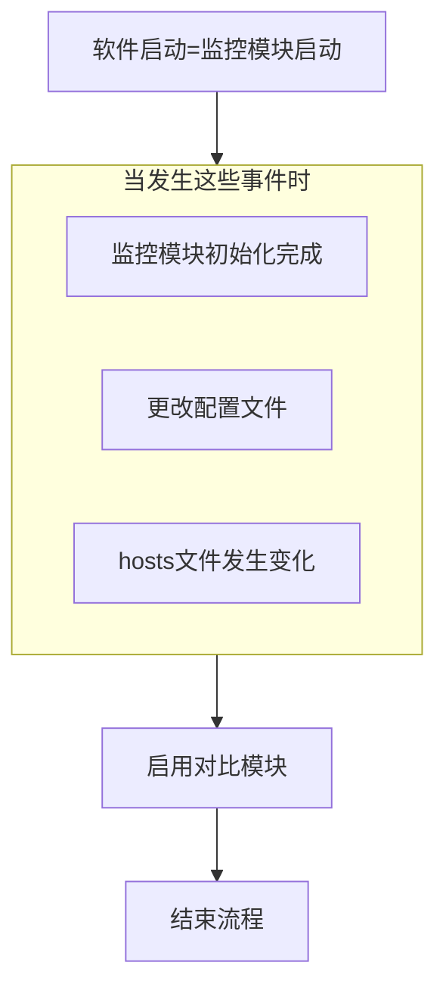
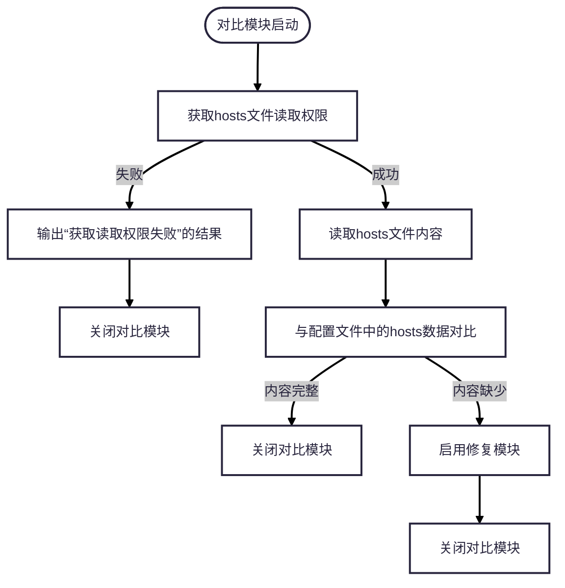
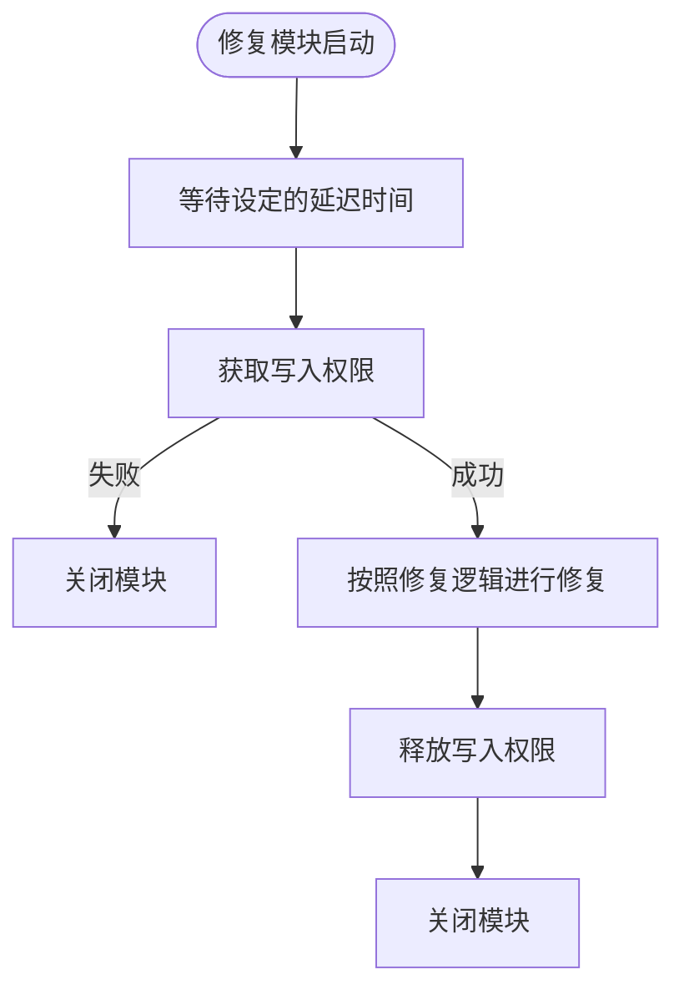

# 项目目录

```
hosts_monitor/                  # 项目根目录
├── hosts_monitor/              # 主程序包，所有核心代码
│   ├── __init__.py
│   ├── main.py                 # 主程序入口
│   ├── ui.py                   # UI显示
│   ├── controller.py           # UI控制器，处理UI和逻辑的交互
│   ├── monitor.py              # 监控模块
│   ├── repair.py               # 修复模块
│   ├── contrast.py             # 对比模块
│   ├── logger.py               # 日志模块
│   ├── config.py               # 配置文件模块
│   └── version.py              # 版本号定义
│
├── resources/                  # 静态资源
│   └── icon.ico                # 软件图标
│
├── run.py			            # 启动脚本
├── requirements.txt            # 依赖库清单
├── README.md                   # 项目说明
└── pyinstaller_build.py        # 打包脚本
```

# 软件要求

- 软件支持设置开机自启
- 软件支持设置管理员后在下次重启时继续以管理员权限运行
- 当软件具备管理员权限时禁用提权按钮
- 需要具有去抖动/节流的逻辑，避免短时间内重复处理
- 将resources/icon.ico(软件图标)一起打包到exe文件
- exe文件在第一次运行时如当前目录无resources/icon.ico，则释放
- 软件在点击最小化时最小化到系统托盘区，开机自启时默认最小化到系统托盘区


# 监控模块

> [!IMPORTANT]
>
> 使用watchfiles



# 对比模块



# 修复模块

> [!IMPORTANT]
>
> 使用pywin32强制共享写访问



修复模块启动 → 等待设定的延迟时间 → 尝试获取写入权限：
├─ 获取失败 → 关闭模块
└─ 获取成功 → 按照修复逻辑进行修复 → 释放写入权限 → 关闭模块

## 修复逻辑 ##

1. 读取配置文件中的hosts数据
1. 如果本地hosts文件中没有与配置文件的相同的数据，则在本地hosts最后一行完整的写入配置文件中的hosts数据
1. 如果有本地hosts文件中只有一行数据与配置文件中的hosts数据相同，则以此位置作为基准点，按配置文件中的数据顺序插入
1. 如果有本地hosts文件中有两行或两行以上的数据与配置文件中的hosts数据相同，则以此第一行相同数据位置作为基准点，按配置文件中的数据顺序插入，并删除其余相同数据。

5. 硬性要求

- 插入本地hosts文件中的数据与原数据上下各有一行空白行。
- 文件末尾不允许有多余空行。

# 日志模块
- 全局日志
- 软件所有的提示信息和操作都需要输出日志
- 跟随程序的操作输出日志
- 所有输出的日志同步更新到UI界面的日志显示界面
- 全部以中文输出

# 软件版本模块

- 全局变量
- 所有需要显示软件版本的地方全部引用此模块

# 配置文件模块

1. 配置文件默认生成在软件运行目录
2. 使用toml做为配置文件
3. 兼容PyInstaller打包
4. 如果不存在则创建默认配置
5. 记录配置hosts数据及软件的设置

# UI模块

- 使用PyQt6

- 软件界面分为上中下三栏
  上栏：
  按钮[以管理员权限运行]、复选框[开机自启]、按钮[打开hosts文件]、输入框[延迟时间(mm)]

  中栏：
  文本输入框[hosts数据]、按钮[保存配置]

  下栏：

  显示框[日志记录]


# UI控制器模块

处理UI与业务逻辑的交互事件

# 依赖文件

- 列出所有本项目需要的库
- 项目使用的第三方库全部使用最新版